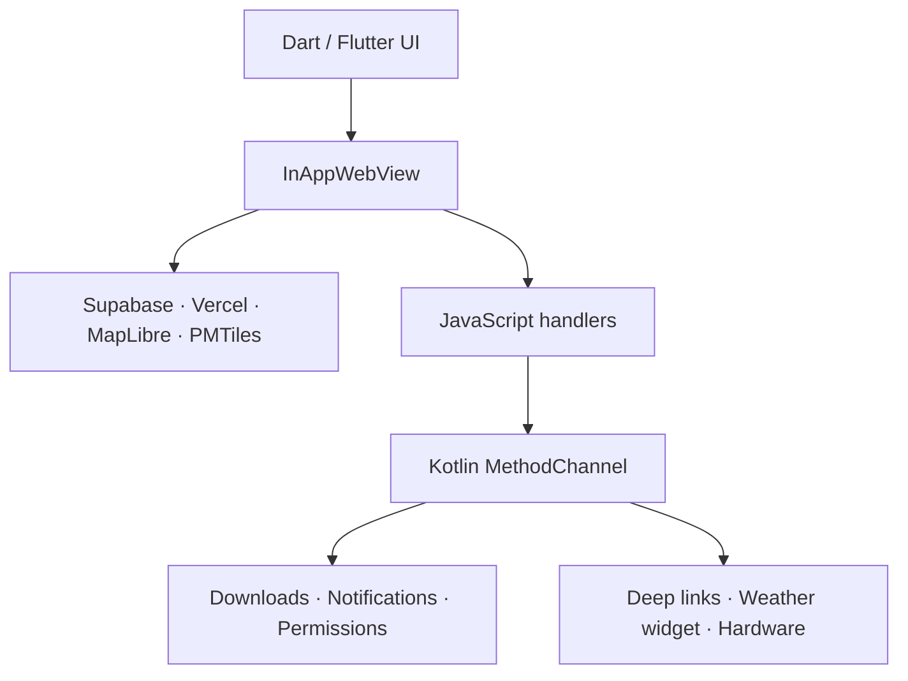

# GEO ANDROID — NAV KURD

Android 7.0+ Flutter application for the current production NAV KURD map at
`https://geo-map-kappa.vercel.app`. This is the canonical trusted origin shared
by the Web deployment, Android App Links and native release checks.

This is a native Flutter shell around the already-tested MapLibre/PMTiles web
runtime. Flutter owns Android lifecycle, security, permissions and system
integration; the deployed map shares Supabase, Vercel, routing, satellite,
language and offline-map behavior with Web. This avoids a risky ground-up
rewrite of the working GIS engine while replacing the Capacitor container with
a Dart/Flutter Android application.

## Included

- Native immersive full-screen mode with transient swipe-to-show system bars.
- One launch experience only: the deployed animated map loader; no duplicate
  native/Flutter logo screen.
- Hardware-accelerated WebView with persistent origin storage, production
  caching, renderer recovery and lower startup memory pressure.
- Fine/coarse location requested only when the map asks for GPS.
- Android DownloadManager for secure HTTPS files and MediaStore for blob files.
- System download progress/completion, scoped storage and Android 7–16 support.
  Offline map data stays in protected persistent WebView/IndexedDB storage;
  exported files use `Downloads/NAV KURD`.
- Permission-aware notification channels, an offline-map-ready alert, a daily
  local-weather summary and a 12-hour release check. Update alerts are emitted
  only when the installed version code is older than the verified release feed.
- Home-screen widget with real Open-Meteo temperature/condition/air-quality,
  location-time clock, API-driven day/night phase, six local day phases, four
  seasons, rain/snow/hail/thunder/fog/dust/wind/heat/cold artwork, reverse
  geocoding, cached offline state, refresh and Locate actions. The widget uses
  launcher-safe rendered weather scenes rather than emoji or fake values.
- Kurdish/Arabic RTL and English LTR widget layouts using the same bundled font
  families as the app. The widget language follows the in-app language.
- `navkurd://` deep links and verified `https://geo-map-kappa.vercel.app` links.
- Google OAuth returns from Chrome to the same WebView with a one-time PKCE
  code; access and refresh tokens are never carried in the deep link.
- Native Android share sheet and external mail/phone/map links.
- Camera permission for the existing place-contribution image picker.
- A guarded native runtime bridge that reports actual Android CPU threads, RAM,
  device/ABI, physical screen, density/refresh rate, EGL GPU/OpenGL capability,
  storage and safe-area values. Unavailable fields stay null; no specifications
  are invented.
- Release shrinking, resource optimization and APK v1/v2/v3/v4 signing.
- Signed universal APK, per-ABI APK and AAB workflow.
- Sanitized native diagnostics for Android/WebView/Flutter crashes, HTTP and
  console errors, device memory, storage, network, battery, permissions and
  widget freshness; the existing feedback preview, copy/email actions and
  consented authenticated submission include this real report.

Remote push notifications are intentionally not faked: scheduled on-device
weather/update notifications are complete, while server-originated FCM push
delivery still requires the owner's Firebase project and a real
`google-services.json`.

## Identity

| Field | Value |
| --- | --- |
| App name | NAV KURD |
| Android application ID | `com.navkurd.app` |
| Version | `8.0.4+80004` |
| Minimum Android | 7.0 / API 24 |
| Target Android | API 36 |
| Default origin | `https://geo-map-kappa.vercel.app` |
| Repository name | `GEO-ANDROID` (GitHub names cannot contain spaces) |

## Termux: private upload and signed build

Keep `NAV-KURD-v8.0.4-ANDROID.zip`, its `.sha256` sidecar and
`NAV-KURD-v8.0.4-ANDROID-TERMUX.sh` with its `.sha256` sidecar in Android
`Download`. After authenticating GitHub CLI as `sarhang-sg`, run:

```bash
termux-setup-storage
cd /storage/emulated/0/Download
sha256sum -c NAV-KURD-v8.0.4-ANDROID.zip.sha256
sha256sum -c NAV-KURD-v8.0.4-ANDROID-TERMUX.sh.sha256
chmod +x NAV-KURD-v8.0.4-ANDROID-TERMUX.sh
bash NAV-KURD-v8.0.4-ANDROID-TERMUX.sh
```

The publisher verifies both manifests, refuses a public destination repository,
preserves existing local edits, fingerprint-gates the established JKS,
dispatches Actions, verifies release hashes and independently compares the APK
certificate with the established NAV KURD identity. The lower-level
`TERMUX.sh` remains for diagnostics; it must never generate a replacement key
for the already-installed app.

## Build settings

The map URL can be changed without editing Dart:

```bash
flutter build apk --release \
  --dart-define=NAV_KURD_APP_URL=https://your-domain.example
```

Only HTTPS origins are accepted. When the host changes, update the Android App
Links host in `AndroidManifest.xml` and publish matching `assetlinks.json`.

## Signing safety

The private files in `signing/` are excluded by `.gitignore` and the final
source ZIP. Never publish
`nav-kurd-release.jks` or `signing.properties`. Every future update installed
over the current APK must be signed with this exact key. Losing it means users
must uninstall the app before installing a differently signed build.

For verified HTTPS App Links, copy the value from
`signing/ANDROID_APP_LINK_SHA256.txt` into the Vercel environment variable
`ANDROID_APP_LINK_SHA256`, then redeploy the existing web application. The
fingerprint is public metadata; the JKS and its passwords are private.

## Architecture



The service worker, IndexedDB/OPFS data and offline pack remain bound to the
canonical HTTPS origin, so downloaded maps survive normal restarts. Android
10+ intentionally does not show a broad “Storage” runtime permission: scoped
storage protects offline data inside the app and MediaStore/DownloadManager
handles public exports. The app never requests all-files or background-location
access.
