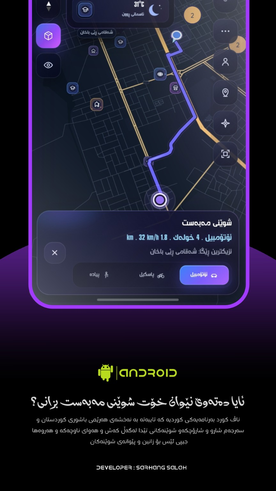
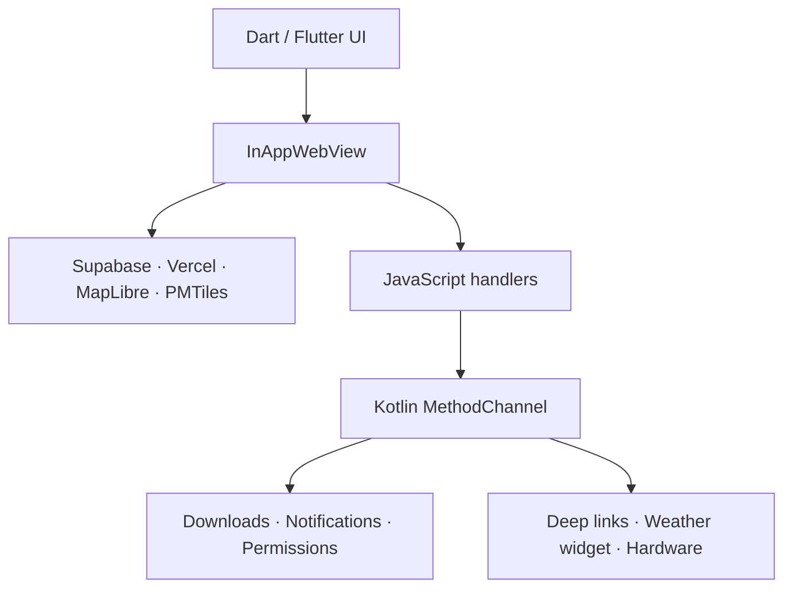

# GEO ANDROID — NAV KURD

<p align="center">
  
</p>

<p align="center">
  
  
  
</p>

Android 7.0+ Flutter application for the current production NAV KURD map at
`https://geo-map-kappa.vercel.app`. This is the canonical trusted origin shared
by the Web deployment, Android App Links and native release checks.

The Flutter shell uses the bundled MapLibre presentation and native SQLite/PMTiles core. Flutter owns lifecycle, local data, permissions and system integration. Server-dependent account, contribution, routing and satellite features retain their existing services. The web app uses the shared interface and its browser-specific data adapters.

## Included

- Native immersive full-screen mode with transient swipe-to-show system bars.
- One launch experience only: the deployed animated map loader; no duplicate
  native/Flutter logo screen.
- Hardware-accelerated WebView with persistent origin storage, production
  caching, renderer recovery and lower startup memory pressure.
- Fine/coarse location requested only when the map asks for GPS.
- Android DownloadManager for secure HTTPS files and MediaStore for blob files.
- System download progress/completion and scoped storage on Android API 24+.
  Bundled SQLite/PMTiles and installed offline map data use the native local core;
  exported files use `Downloads/NAV KURD`.
- Permission-aware notification channels, an offline-map-ready alert, a daily
  local-weather summary and a 12-hour release check. Update alerts are emitted
  only when the installed version code is older than the verified release feed.
- Home-screen widget with real Open-Meteo temperature/condition/air-quality,
  location-time clock, API-driven day/night phase, six local day phases, four
  seasons, rain/snow/hail/thunder/fog/dust/wind/heat/cold artwork, reverse
  geocoding, cached offline state, refresh and Locate actions. The widget uses
  launcher-safe rendered weather scenes rather than emoji or fake values.
- Kurdish/Arabic RTL widget text uses `UniQAIDAR-Money-Heist-002.ttf`; English
  widget text uses `RedHatDisplay-Variable.woff2`. The widget language follows
  the in-app language.
- `navkurd://` deep links and verified `https://geo-map-kappa.vercel.app` links.
- Google OAuth returns from Chrome to the same WebView with a one-time PKCE
  code; access and refresh tokens are never carried in the deep link.
- Native Android share sheet and external mail/phone/map links.
- Camera permission for the existing place-contribution image picker.
- A guarded native runtime bridge that reports actual Android CPU threads, RAM,
  device/ABI, physical screen, density/refresh rate, EGL GPU/OpenGL capability,
  storage and safe-area values. Unavailable fields stay null; no specifications
  are invented.
- Release shrinking, resource optimization and APK v1/v2/v3/v4 signing.
- Signed universal APK and Android App Bundle workflow.
- Sanitized native diagnostics for Android/WebView/Flutter crashes, HTTP and
  console errors, device memory, storage, network, battery, permissions and
  widget freshness; the existing feedback preview, copy/email actions and
  consented authenticated submission include this real report.

Remote push notifications are intentionally not faked: scheduled on-device
weather/update notifications are complete, while server-originated FCM push
delivery still requires the owner's Firebase project and a real
`google-services.json`.

## Identity

| Field | Value |
| --- | --- |
| App name | NAV KURD |
| Android application ID | `com.navkurd.app` |
| Version | `10.0.0+100000` |
| Minimum Android | 7.0 / API 24 |
| Target Android | API 37 |
| Default origin | `https://geo-map-kappa.vercel.app` |
| Repository name | `GEO-ANDROID` (GitHub names cannot contain spaces) |

## Termux: coordinated V10 release

Extract `NAV-KURD-10.0.0-RELEASE-KIT.zip`, then run `bash RUN-TERMUX.sh` from its directory. The kit contains both complete source archives and their checksums. It uses the existing GitHub signing secrets, builds and verifies the signed APK/AAB, publishes their verified release and then updates the existing Vercel integration.

The installer uses normal commits and a baseline backup tag, checks for unexpected remote changes and can resume after a network interruption. Old completed runs are cleaned only after replacement verification. Optional Vercel cleanup requires the owner's `VERCEL_TOKEN` and retains active or aliased deployments. No private signing backup needs to be downloaded into the source tree.

Run `bash RUN-TERMUX.sh --verify-only` to verify local package integrity without changing a repository. Signed binaries are written into `Download/NAV-KURD-10.0.0/` by the successful CI workflow; this source ZIP is not itself an APK.

## Build settings

The release toolchain is pinned to mutually supported stable versions:

| Component | Version |
| --- | --- |
| Flutter | `3.47.1` |
| Android Gradle Plugin | `9.2.1` |
| Gradle | `9.4.1` |
| Kotlin | AGP 9 built-in Kotlin; KGP `2.4.0` resolution only |
| Android compile/target SDK | `37` |
| Flutter plugin compile SDK | `36` |
| Android build tools | app `37.0.0`; plugin default `36.0.0` |

The stable `flutter_inappwebview_android` 1.1.3 runtime source is included under
`packages/` with its Apache-2.0 license. Its Android build definition is migrated
to the AGP 9 public DSL and optimized R8 defaults in the repository itself. The
release therefore uses no pub-cache rewrite, prerelease package, skipped build
validation or AGP 9 compatibility escape hatch.

Flutter 3.47.1 still reads the legacy Android variants bridge while AGP 9 uses
built-in Kotlin. `android.newDsl=false` selects that documented compatibility
bridge without disabling built-in Kotlin. KGP 2.4.0 is declared with
`apply false` only so Flutter's dependency validator resolves a supported
version; it is not applied to the app or vendored plugin modules.

`pubspec.lock` is committed and CI resolves it with
`flutter pub get --enforce-lockfile`. App-owned Dart code and tests are analyzed
strictly from `lib` and `test`; the unchanged vendored upstream package is
compiled and tested by Gradle but does not inherit the app's private lint set.

The map URL can be changed without editing Dart:

```bash
flutter build apk --release \
  --dart-define=NAV_KURD_APP_URL=https://your-domain.example
```

Only HTTPS origins are accepted. When the host changes, update the Android App
Links host in `AndroidManifest.xml` and publish matching `assetlinks.json`.

## Signing safety

The private files in `signing/` are excluded by `.gitignore` and the final
source ZIP. Never publish
`nav-kurd-release.jks` or `signing.properties`. Every future update installed
over the current APK must be signed with this exact key. Losing it means users
must uninstall the app before installing a differently signed build.

For verified HTTPS App Links, copy the value from
`ANDROID_APP_LINK_SHA256.txt` into the Vercel environment variable
`ANDROID_APP_LINK_SHA256`, then redeploy the existing web application. The
fingerprint is public metadata; the JKS and its passwords are private.

## Architecture


```mermaid
flowchart TD
    A["Dart / Flutter UI"] --> B["InAppWebView"]
    B --> C["Supabase · Vercel · MapLibre · PMTiles"]
    B --> D["JavaScript handlers"]
    D --> E["Kotlin MethodChannel"]
    E --> F["Downloads · Notifications · Permissions"]
    E --> G["Deep links · Weather widget · Hardware"]
```

Android uses its native local core for bundled data and offline maps; Web uses its service worker and browser storage. Both preserve saved state during ordinary restarts. Android
10+ intentionally does not show a broad “Storage” runtime permission: scoped
storage protects offline data inside the app and MediaStore/DownloadManager
handles public exports. The app never requests all-files access. Optional widget background location is disabled by default and requires explicit opt-in plus Android permission.
